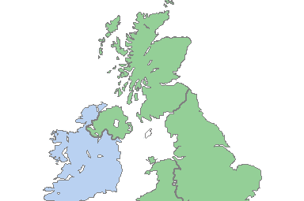

<h1>Welcome</h1>

This is my example website about learning English.

<h2>What will you find on this website?</h2>

Here you can learn about English accents, grammar and vocabulary, and some cultural information about England

  

    

      

        <a href="images/uk-shrink.png" target="_blank">
          
          

            
Map of British Isles. As you can see, it's an island.

          

        </a>
      

    

    

      

        <a href="https://openclipart.org/download/313133/1546702438.svg" target="_blank">
          
          

            
The flag of the United Kingdom. This is intended to represent the flags of England, Scotland and Wales. It's called the Union Jack.

          

        </a>
      

    

    

      

        <a href="https://upload.wikimedia.org/wikipedia/commons/thumb/4/40/Fish_and_chips_Portobello_Road.jpg/640px-Fish_and_chips_Portobello_Road.jpg" target="_blank">
          
          

            
<strong>Culture:</strong>There is much more to British culture than Fish and Chips!! Explore this website to learn more.

          

        </a>
      

    

