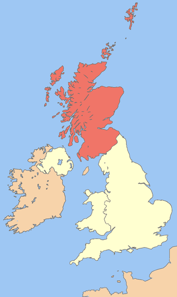

<h1>Page 2</h1>

Some content

  

    

      <a href="images/scotland.png">
        
        

          
Scotland is one of the countries of the UK

        

      </a>
    

  

  

    

      <a href="/w3images/nature.jpg">
        
        

          
Lorem ipsum...

        

      </a>
    

  

  

    

      <a href="/w3images/fjords.jpg">
        
        

          
Lorem ipsum...

        

      </a>
    

  

